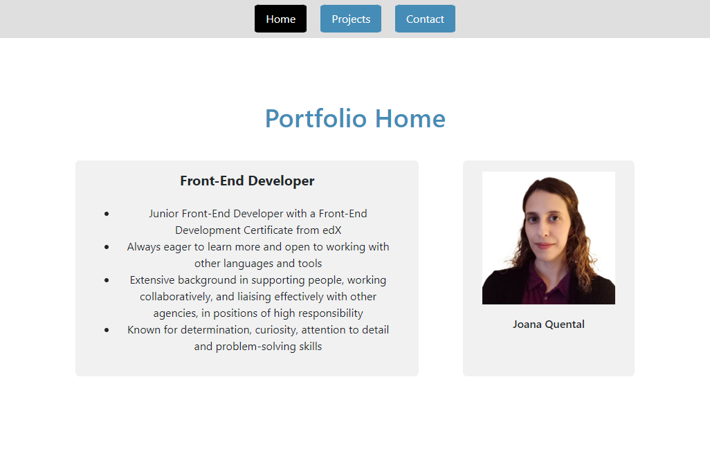
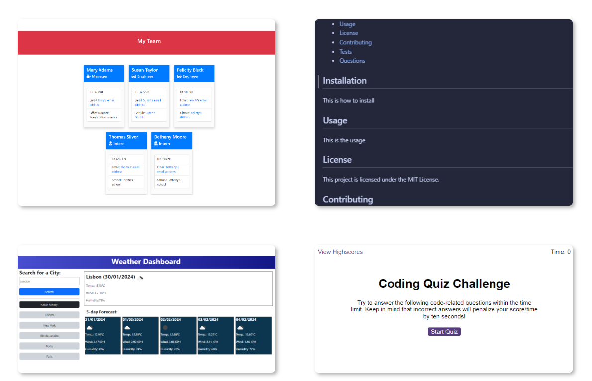
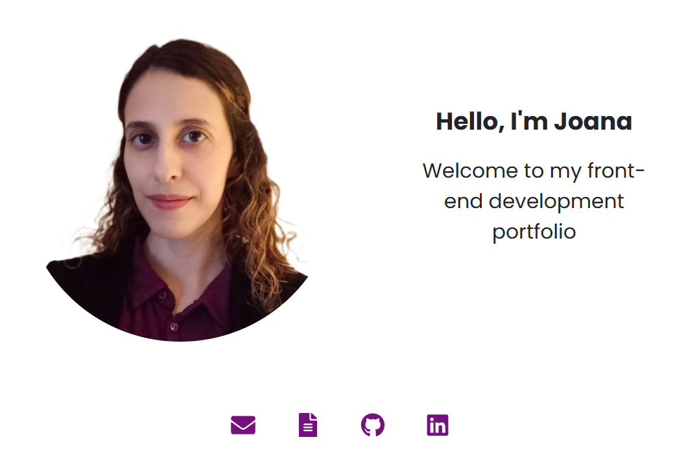

# React Portfolio

This repository contains my portfolio created using React. Link to deployed application: https://joanaportfolio.netlify.app/

## Description

This is a responsive React application which contains my portfolio of projects built as a front-end developer, and my contact information.

## Table of Contents

* [Usage](#usage)
* [Code](#code)
* [Credits](#credits)
* [License](#license)

## Usage

When the user enters the website they will come across a navbar with a logo and the relevant pages. The navbar collapses on small screens.

The 'Projects' section displays several projects I have completed as a front-end developer, including title, screenshot, and the relevant links to visit the individual projects.

The 'About' section displays a brief introduction, links my relevant pages, contact and CV.

## Code

The development of this application used mainly React, React Router, JavaScript, HTML, CSS, Bootstrap, JSON and Node.js. 

## Credits

I have used Google, AI, React and Bootstrap documentation to research the information I needed to complete this.

## License

Licensed under the MIT license.